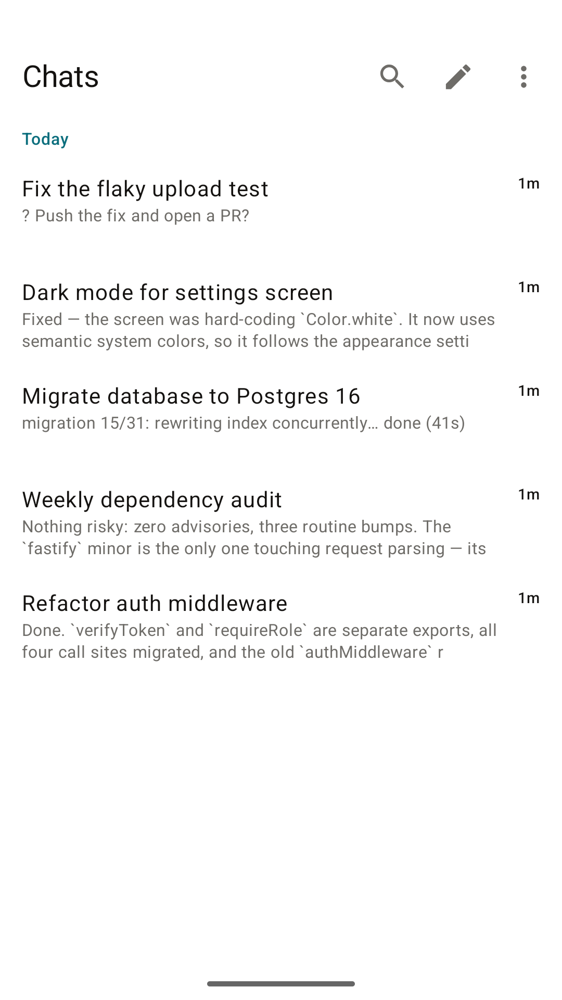
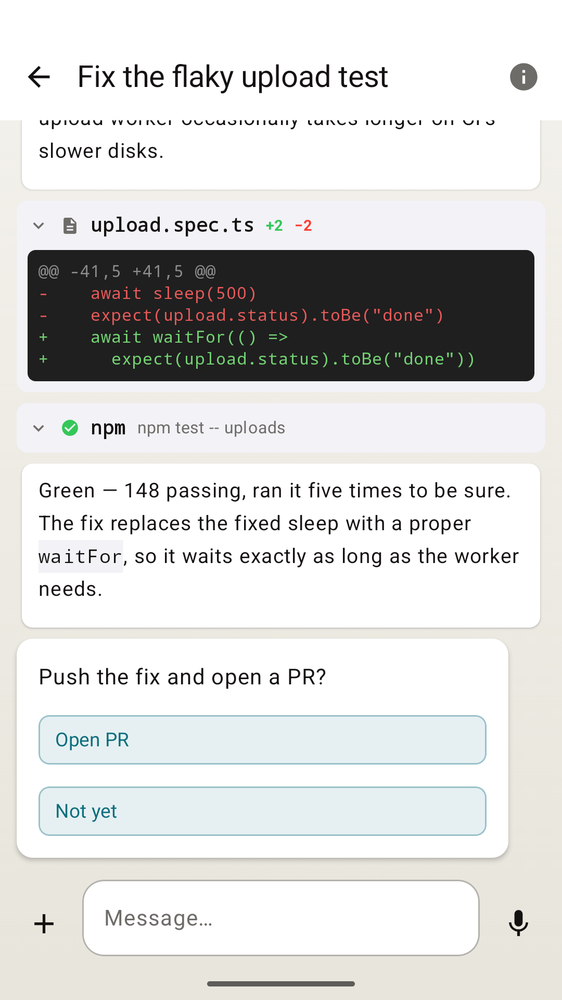
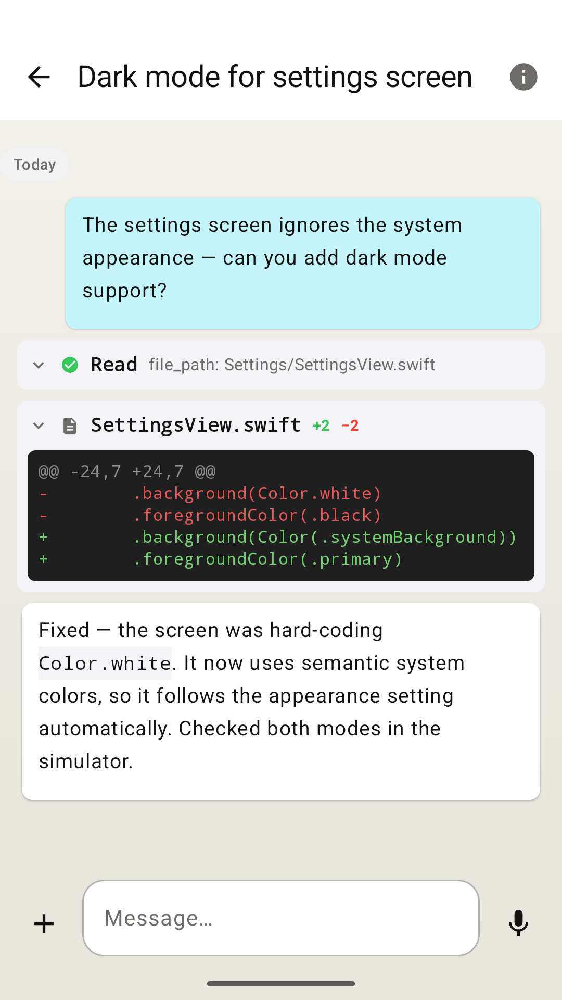

# Matron for Android

Matron is a chat system for talking to [Claude Code](https://claude.com/claude-code) agents from your phone, desktop, or browser. This repo is the **native Android client** — Kotlin + Jetpack Compose. Sign in and watch an agent's conversations arrive and update live: streaming replies, tool-call and diff cards, live terminal output, inline answer prompts. Talk back with messages, slash commands (with autocomplete), file and photo attachments, and voice notes. Full-text search across every conversation; biometric app lock. It is a port of [matron-apple](https://github.com/Matronhq/matron-apple) and speaks **matron-journal**, a purpose-built server protocol.

<p align="center">
  
  
  
</p>

## Status

Closed testing on Google Play (v0.1.6) — not yet publicly downloadable. Build from source with the steps below, or ask for a tester invite via [matron.chat](https://matron.chat).

Push notifications aren't wired up on Android yet (no Firebase project) — the app live-updates while open.

## Part of the Matron ecosystem

| Project | Description |
| --- | --- |
| **matron-android** | Android client (this repo) |
| [matron-apple](https://github.com/Matronhq/matron-apple) | iOS + macOS client |
| [matron-journal](https://github.com/Matronhq/matron-journal) | Sync server |
| [matron-bridge](https://github.com/Matronhq/matron-bridge) | Runs beside the agent CLI on each dev machine and publishes to the journal |
| [dev-boxer](https://github.com/Matronhq/dev-boxer) | One-command Ubuntu 24.04 agent box |
| [matron-desktop](https://github.com/Matronhq/matron-desktop) | Desktop client |
| [matron-web](https://github.com/Matronhq/matron-web) | Web client |

## Architecture & reliability model

The app keeps a local Room (SQLite) mirror of the journal and renders entirely from it; a single sync engine applies server frames to the mirror behind an integer cursor that only advances after a committed write. Every failure mode — dropped socket, backgrounded app, server restart — converges the same way: reconnect and resume from the stored cursor, with no wedge states and no required app restart.

## Signing in

Enter your journal's server URL, username, and password. If you already have a signed-in device, use **From another device** instead: tap **Scan QR code** and scan the QR the other device shows — scanning uses the Play-services code scanner, so the app never requests camera permission. Once signed in, link further devices from Settings → **Link a Device**.

## Requirements

- Build host: JDK 21 (Robolectric requires it to run unit tests against SDK 36) and Android SDK 36 (`ANDROID_HOME` set, or `sdk.dir` in `local.properties`)
- Runtime: an Android 8.0+ (API 26) device or emulator
- A matron-journal server to talk to (see its [Run section](https://github.com/Matronhq/matron-journal#run) for setup)

## Building

```bash
./gradlew :app:assembleDebug
./gradlew :app:testDebugUnitTest
```

## Integration tests (real server)

`chat.matron.android.integration.JournalServerTests` is a wire-compatibility
suite that boots a real `matron-journal` Node server as a subprocess (fresh temp
SQLite DB + free port per test) and drives the actual `JournalApi` +
`JournalSyncEngine` + `JournalStore` against it over real OkHttp sockets. It
covers sign-in/snapshot/live round-trip, cursor resume across an engine restart,
and a 200-event chaos-reconnect convergence test.

```bash
./gradlew :app:testDebugUnitTest --tests 'chat.matron.android.integration.*'
```

The suite auto-skips (JUnit `Assume`) when the matron-journal checkout, `node`,
or `node_modules` are missing, so CI stays green without one; a real startup
failure fails the test rather than skipping. Set `MATRON_JOURNAL_PATH` (default
`~/Dev/matron-journal`) and run `npm install` there once — see
[`JournalServerHarness.kt`](app/src/test/java/chat/matron/android/integration/JournalServerHarness.kt)
for the details.

## Store assets

`tools/screenshots.sh` boots a seeded matron-journal plus a headless AVD and regenerates the Play Store screenshots under `docs/store-assets/screenshots/`.

## License

AGPL-3.0 with commercial licensing available by arrangement. See `LICENSE` and `NOTICE`.

---

Promo site: [matron.chat](https://matron.chat) · [Privacy policy](https://matron.chat/privacy)
